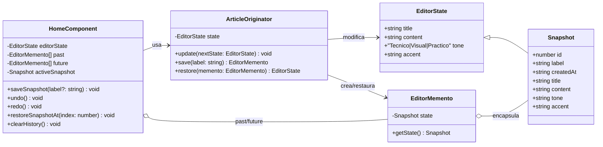
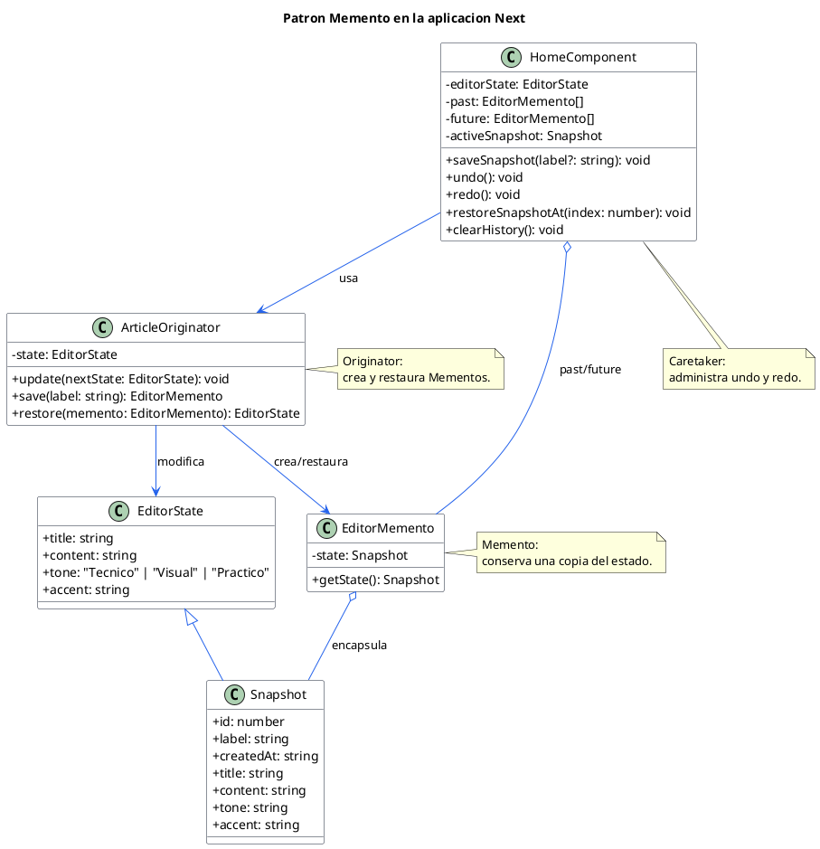

# Diagrama de clases: Patron Memento en esta aplicacion

Este diagrama describe la implementacion usada en `app/page.tsx`.

## Lectura del patron

- `ArticleOriginator` es el Originator: conoce el estado editable y sabe crear/restaurar snapshots.
- `EditorMemento` es el Memento: guarda una copia del estado y solo expone `getState()`.
- `HomeComponent` actua como Caretaker: mantiene `past` y `future`, pero no modifica internamente el Memento.
- `Snapshot` extiende el estado con metadatos visuales para el historial: `id`, `label` y `createdAt`.

## Version PlantUML

